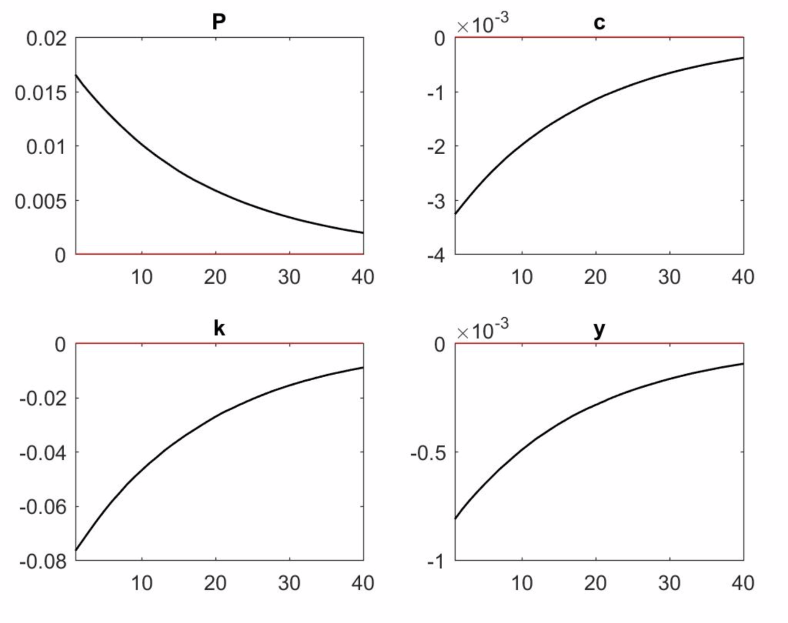

  

      <ul class="nav">
          <li><a href="iplotCorr.html">prev</a></li>
          <li><a href="samplemixups_fig7.html">next</a></li>
      </ul>
  

Using Cash-in-Advance model to  estimate  the shock of  China stimulate package

**Figure 4**. &mdash; By using the CIA  model, we estimate the nomal and technological shock that 
the stimulate package will deal to the whole economy including consumption, export and saving.
